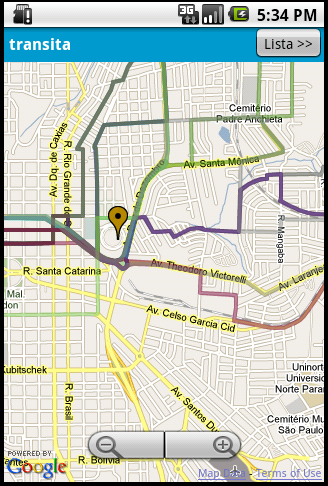
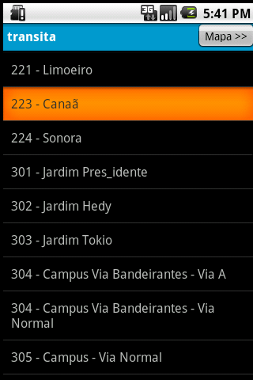

We Won Sercomtel University Contest
###################################

:date: 2011-01-27
:tags: contest
:category: programming

During the second half of 2010, I attended the Sercomtel University Contest in the apps category, developing an Android app to search for bus routes in Londrina city.

The project was presented in Sercomtel in december/2010 and we received the first prize. My team received BRL 5000 (divided in parts based on how much which member was involved in the project) and a mobile phone to our teacher advisor `Eduardo Guerra <http://www.twitter.com/emguerra>`_. Another team from `my school (ITA) <http://www.ita.br>`_ received the third prize in the games category.

You can take a look at `Transita presentation <http://www.slideshare.net/iurisilvio/transita>`_. It was an awesome experience, using geohashing algorithms to optimize calculations and `Google App Engine <https://developers.google.com/appengine>`_ servers to host some `bottle <http://bottlepy.org>`_ based services.

I got involved in this contest because of `ITABits <http://blogs.alphachannel.com.br/itabits/>`_, an alumni group learning about game development and other awesome things.

You can see below two pics of this app.

Some links about this achievement (in portuguese):

- `ALUNOS DO ITA CRIAM A ITAbits E SÃO PREMIADOS <http://www.ita.br/online/2011/noticias11/itabits.htm>`_
- `Sercomtel Celular anuncia vencedores do concurso de games e aplicativos <http://www.planetasercomtel.com.br/cont/contFull.asp?categoria=105&nrseq=96705>`_