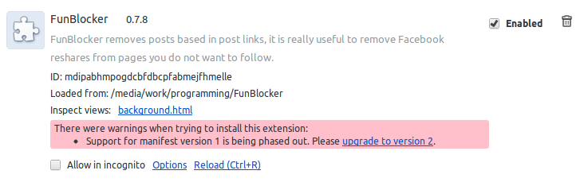

Chrome will break extensions backward compatibility
###################################################

:date: 2012-07-28
:tags: chrome
:category: programming

If you develop a Chrome Extension, you should know that. Some days ago, I received a scary red warning during development of `FunBlocker <https://chrome.google.com/webstore/detail/cgdkiknkffmdbonojkcofooaampcefom>`_ Chrome Extension.

No problem, I can just follow the rules defined in `Chrome Extensions Manifest Version <http://code.google.com/chrome/extensions/manifestVersion.html>`_ and migrate my manifest to get rid of this warning. I just released it and broke my plugin. Why?? It was suposed to Chrome maintain everything up to date and working fine.

======================
Things you should know
======================

* You can disable Chrome auto updates. Yeah, it is not a good option, but I can not blame the user.
* Chrome Extensions are in fact Chromium extensions. Other Chromium based browsers do not update often and extension developers do not have an easy way to handle that.
* Chrome will maintain the extension up to date, even if it does not understand the manifest file.

Reading some docs, I found I can set `minimum_chrome_version <http://code.google.com/chrome/extensions/manifest.html#minimum_chrome_version>`_, but to be honest my app does not depend of the Chrome version.

Based in Chrome schedule, Web Store will block new extensions with ``manifest_version=1`` after Chrome 21 release. I am just maintaining an extension, so it is not a problem for me. Web Store will block updates with ``manifest_version=1`` after Chrome 23 release, planned to early november 2012.

Based in my Analytics data, I have more than 3% of users in browser versions minor than 18 or in Rockmelt, which will not work with manifest upgrade.

===========
My solution
===========

I decided to maintain ``manifest_version=1`` as long as possible (maybe early november). In next months, I will add a friendly warning to my options page like "sorry, but this plugin will not receive updates until you update your browser". After that, I will add ``minimum_chrome_version=18`` and upgrade the `manifest_version <http://code.google.com/chrome/extensions/manifest.html#manifest_version>`_. Docs does not recommended to use version 2 in Chrome 17, so 18 is a good number.

Just to be clear, I am not against this manifest upgrade, it is really interesting to improve browser security, but some changes break compatilibity instead of do a painless transition.